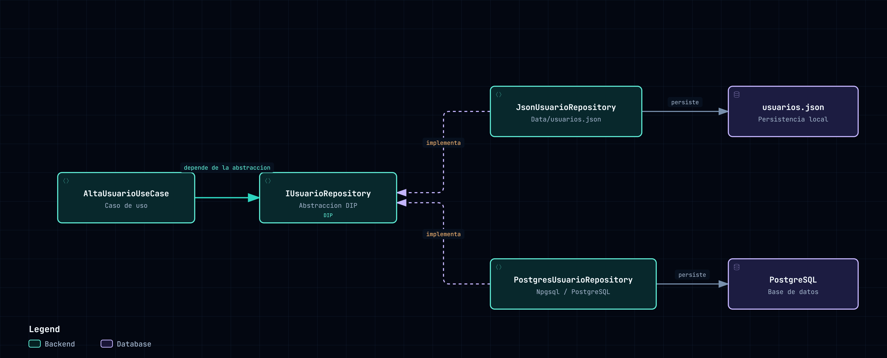
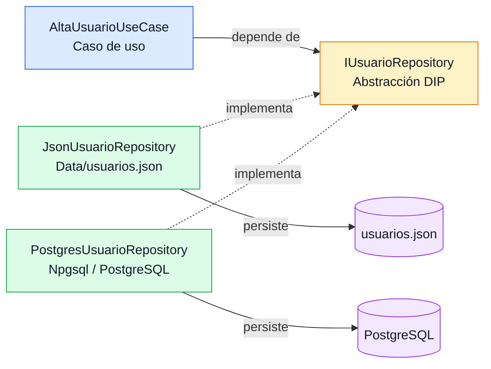

# Alta de Usuarios con SOLID

Implementación práctica de los principios **SOLID** —en particular la **Inversión de Dependencias (DIP)** y el **Patrón Repository**— aplicada al caso de uso **"Dar de Alta Usuario"**.

La solución está dividida en dos aplicaciones:

- **Backend:** API REST en C# con ASP.NET Core (.NET 6).
- **Frontend:** formulario web en Next.js, React y TypeScript.

El objetivo principal es demostrar cómo una aplicación puede **cambiar su mecanismo de persistencia sin modificar el caso de uso ni el controlador**. La selección entre un archivo JSON y PostgreSQL se realiza cambiando una sola línea en el registro de dependencias de `Program.cs`.

## Índice

1. [Estructura del proyecto](#estructura-del-proyecto)
2. [Arquitectura y diagrama del problema](#arquitectura-y-diagrama-del-problema)
3. [Inversión de Dependencias (DIP)](#inversión-de-dependencias-dip)
4. [Patrón Repository](#patrón-repository)
5. [El truco de la línea](#el-truco-de-la-línea)
6. [Requisitos previos](#requisitos-previos)
7. [Clonar el repositorio](#clonar-el-repositorio)
8. [Configuración y seguridad](#configuración-y-seguridad)
9. [Ejecutar el backend](#ejecutar-el-backend)
10. [Ejecutar el frontend](#ejecutar-el-frontend)
11. [API](#api)
12. [Valor didáctico](#valor-didáctico)

---

## Estructura del proyecto

```text
.
├── Ejemplo/
│   ├── Controllers/
│   ├── Data/                   # usuarios.json se genera acá en modo JSON
│   ├── Domain/
│   ├── DTOs/
│   ├── Repositories/
│   ├── Services/
│   ├── Program.cs              # Composition root — "el truco de la línea"
│   ├── appsettings.json
│   └── database.sql
├── frontend/
│   ├── app/
│   ├── package.json
│   └── tsconfig.json
└── docs/
    └── archify/
        └── solid-dip.png       # Diagrama de dominio y capas (ver sección siguiente)
```

---

## Arquitectura y diagrama del problema

El flujo principal de la aplicación es el siguiente:

```text
Frontend Next.js
       |
       v
UsuariosController
       |
       v
AltaUsuarioUseCase
       |
       v
IUsuarioRepository
       |
       +--> JsonUsuarioRepository
       |
       +--> PostgresUsuarioRepository
```

El controlador recibe la solicitud HTTP y delega la operación al caso de uso. El caso de uso contiene las reglas de negocio y solo conoce la abstracción `IUsuarioRepository`. Las implementaciones concretas se encargan de persistir los datos en JSON o PostgreSQL.

El siguiente diagrama ilustra la aplicación del Principio de Inversión de Dependencias (DIP): el caso de uso (`AltaUsuarioUseCase`) depende de una abstracción (`IUsuarioRepository`), lo que permite alternar dinámicamente entre una persistencia local en JSON (`JsonUsuarioRepository`) y una base de datos relacional (`PostgresUsuarioRepository`) sin modificar la lógica de negocio.



[Ver diagrama interactivo de arquitectura (HTML)](https://tadegmor.github.io/solid-dip-alta-usuario/archify/solid-dip.html)
---

## Inversión de Dependencias (DIP)

El principio de Inversión de Dependencias establece que los módulos de alto nivel no deben depender de módulos de bajo nivel concretos. Ambos deben depender de abstracciones.

En este proyecto:

- `AltaUsuarioUseCase` es un módulo de alto nivel porque coordina las reglas del caso de uso.
- `JsonUsuarioRepository` y `PostgresUsuarioRepository` son módulos de bajo nivel porque conocen los detalles de persistencia.
- `IUsuarioRepository` es la abstracción que desacopla ambos niveles.

La interfaz define las operaciones que necesita el caso de uso:

```csharp
public interface IUsuarioRepository
{
    Task AgregarAsync(Usuario usuario, CancellationToken cancellationToken);
    Task<bool> ExisteEmailAsync(string email, CancellationToken cancellationToken);
    Task<IReadOnlyCollection<Usuario>> ObtenerTodosAsync(
        CancellationToken cancellationToken);
}
```

El caso de uso recibe esa abstracción por inyección de dependencias:

```csharp
public sealed class AltaUsuarioUseCase
{
    private readonly IUsuarioRepository _usuarioRepository;

    public AltaUsuarioUseCase(IUsuarioRepository usuarioRepository)
    {
        _usuarioRepository = usuarioRepository;
    }
}
```

Por lo tanto, `AltaUsuarioUseCase` no necesita saber si los usuarios se guardan en un archivo, en PostgreSQL o en otra implementación futura. Sus reglas permanecen iguales:

- Verificar que el email y su confirmación coincidan.
- Verificar que la contraseña y su confirmación coincidan.
- Validar la localidad.
- Comprobar que el email no esté registrado.
- Crear el usuario y guardar sus datos.

El siguiente diagrama resume esa relación de dependencia hacia la abstracción:



---

## Patrón Repository

El patrón Repository encapsula el acceso a los datos detrás de una interfaz orientada al dominio. Esto evita que el controlador o el caso de uso dependan directamente de archivos, SQL o bibliotecas de acceso a datos.

El proyecto contiene dos repositorios intercambiables:

```csharp
public sealed class JsonUsuarioRepository : IUsuarioRepository
{
    // Persistencia en Data/usuarios.json
}

public sealed class PostgresUsuarioRepository : IUsuarioRepository
{
    // Persistencia mediante Npgsql y PostgreSQL
}
```

Ambas clases cumplen el mismo contrato. El resto de la aplicación puede trabajar con `IUsuarioRepository` sin conocer la implementación elegida.

---

## El truco de la línea

La composición de la aplicación se realiza en `Ejemplo/Program.cs`. Para usar el archivo JSON:

```csharp
// Persistencia en archivo JSON
builder.Services.AddSingleton<IUsuarioRepository, JsonUsuarioRepository>();
```

Para usar PostgreSQL, se comenta la línea anterior y se registra la implementación de PostgreSQL:

```csharp
// builder.Services.AddSingleton<IUsuarioRepository, JsonUsuarioRepository>();
builder.Services.AddScoped<IUsuarioRepository, PostgresUsuarioRepository>();
```

El bloque completo queda así cuando se utiliza PostgreSQL:

```csharp
builder.Services.AddControllers();
builder.Services.AddCors(options => options.AddDefaultPolicy(policy =>
    policy.AllowAnyOrigin().AllowAnyHeader().AllowAnyMethod()));

// Cambiar solamente esta línea para seleccionar la persistencia.
// builder.Services.AddSingleton<IUsuarioRepository, JsonUsuarioRepository>();
builder.Services.AddScoped<IUsuarioRepository, PostgresUsuarioRepository>();
builder.Services.AddScoped<AltaUsuarioUseCase>();
```

El controlador y `AltaUsuarioUseCase` no cambian al alternar entre ambas opciones. Esta es la aplicación concreta del DIP: la decisión sobre la infraestructura queda concentrada en el composition root, que en este caso es `Program.cs`.

> La configuración actual del repositorio utiliza la persistencia en **JSON** (`JsonUsuarioRepository`). Para utilizar PostgreSQL, basta con comentar esa línea e inactivar el repositorio JSON, activando en su lugar la de `PostgresUsuarioRepository` en el registro de dependencias (Inyección de Dependencias en C#).

---

## Requisitos previos

Instalar las siguientes herramientas:

- **.NET SDK 6.0** o un SDK compatible con el target `net6.0`.
- **Node.js 18.17 o superior**, recomendado para Next.js 14.
- **npm**, incluido normalmente con Node.js.
- **PostgreSQL 12 o superior**, únicamente si se utilizará `PostgresUsuarioRepository`.
- **Git**, para clonar el repositorio.

Comprobar las instalaciones:

```powershell
dotnet --version
node --version
npm --version
git --version
```

---

## Clonar el repositorio

```powershell
git clone https://github.com/tadegmor/solid-dip-alta-usuario.git
cd solid-dip-alta-usuario
```

---

## Configuración y seguridad

Antes de ejecutar el proyecto (y **antes de publicarlo**), revisar estos puntos:

- `Ejemplo/appsettings.json` incluye una cadena de conexión de **ejemplo** para uso local:

  ```json
  {
    "ConnectionStrings": {
      "Postgres": "Host=localhost;Port=5432;Database=postgres;Username=postgres;Password=CHANGE_ME"
    }
  }
  ```

  Estas credenciales son válidas solo en el entorno local del autor. Quien clone el repositorio debe **reemplazarlas por las propias**, o mejor aún, sobreescribirlas con una variable de entorno sin tocar el archivo versionado:

  ```powershell
  $env:ConnectionStrings__Postgres = "Host=localhost;Port=5432;Database=postgres;Username=postgres;Password=TU_PASSWORD"
  ```

- `Ejemplo/Data/usuarios.json` se genera en tiempo de ejecución cuando se usa el modo JSON. **No debe subirse al repositorio** (contiene datos de prueba y hashes de contraseñas).
- El frontend usa `NEXT_PUBLIC_API_URL` para apuntar al backend; no hay secretos en el frontend por defecto.

---

## Ejecutar el backend

> **Nota:** Todos los comandos de esta sección se ejecutan posicionándote en la carpeta `Ejemplo`.

### Opción A: persistencia JSON

Esta opción no requiere PostgreSQL.

1. Desde la raíz del repositorio, navegar a la carpeta del backend:

  ```powershell
  cd Ejemplo
  ```

2. Abrir `Program.cs`, activar el repositorio JSON y comentar el repositorio PostgreSQL:

   ```csharp
   builder.Services.AddSingleton<IUsuarioRepository, JsonUsuarioRepository>();
   // builder.Services.AddScoped<IUsuarioRepository, PostgresUsuarioRepository>();
   ```

3. Restaurar dependencias y ejecutar la API:

   ```powershell
   dotnet restore
   dotnet run --urls http://localhost:5000
   ```

Los usuarios se guardan en `Ejemplo/Data/usuarios.json`.

### Opción B: persistencia PostgreSQL

1. Iniciar el servicio de PostgreSQL.
2. Crear la tabla utilizando el script incluido:

   ```powershell
  psql -h localhost -U postgres -d postgres -f database.sql
   ```

3. Revisar la cadena de conexión en `Ejemplo/appsettings.json` (ver [Configuración y seguridad](#configuración-y-seguridad)).
4. Confirmar en `Program.cs` que esté registrada la implementación PostgreSQL:

   ```csharp
   // builder.Services.AddSingleton<IUsuarioRepository, JsonUsuarioRepository>();
   builder.Services.AddScoped<IUsuarioRepository, PostgresUsuarioRepository>();
   ```

5. Restaurar dependencias y ejecutar la API:

   ```powershell
   dotnet restore
   dotnet run --urls http://localhost:5000
   ```

> **Para alternar entre JSON y PostgreSQL:** abrí `Ejemplo/Program.cs` y elegí cuál línea dejar activa en el registro de dependencias antes de ejecutar `dotnet run`.

---

## Ejecutar el frontend

> **Nota:** Abrí una **segunda terminal** para el frontend.

Si estás parado en la raíz del repositorio:

```powershell
cd frontend
```

Si tu terminal está parada dentro de la carpeta `Ejemplo`:

```powershell
cd ../frontend
```

Instalar dependencias e iniciar:

```powershell
npm install
npm run dev
```

Abrir [http://localhost:3000](http://localhost:3000) en el navegador.

El frontend utiliza `http://localhost:5000` como URL predeterminada del backend. Para indicar otra URL de API en PowerShell:

```powershell
$env:NEXT_PUBLIC_API_URL = "http://localhost:5000"
npm run dev
```

Comandos disponibles:

```powershell
npm run dev      # Servidor de desarrollo
npm run build    # Compilación de producción
npm start        # Servidor de producción
```

---

## API

### Crear un usuario

```text
POST /api/usuarios
```

Ejemplo de solicitud:

```json
{
  "nombreUsuario": "ana",
  "email": "ana@example.com",
  "confirmarEmail": "ana@example.com",
  "password": "secret",
  "confirmarPassword": "secret",
  "nombre": "Ana",
  "apellido": "Gomez",
  "localidadId": 1,
  "calle": "San Martin",
  "numero": "123"
}
```

Una operación exitosa devuelve `201 Created`. Los errores de validación del caso de uso devuelven `400 Bad Request` con un mensaje descriptivo.

### Obtener usuarios

```text
GET /api/usuarios
```

Devuelve la colección de usuarios registrados sin exponer el hash de la contraseña.

---

## Valor didáctico

Este ejemplo permite observar una consecuencia concreta de SOLID: cambiar una decisión de infraestructura no obliga a reescribir las reglas de negocio. El caso de uso depende de un contrato estable, las implementaciones de persistencia son reemplazables y el contenedor de inyección de dependencias conecta cada abstracción con la implementación elegida.