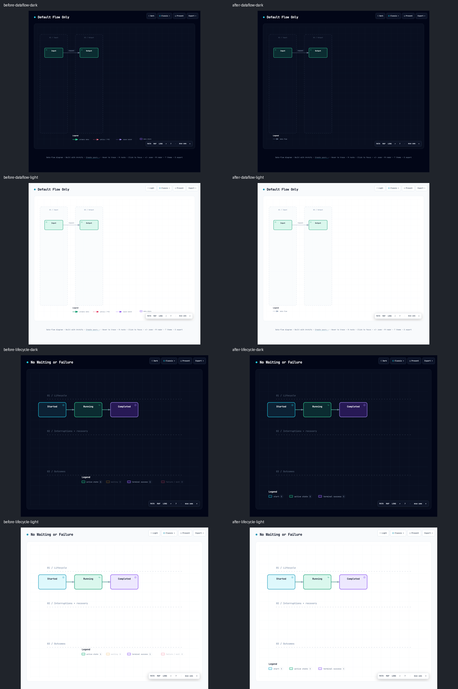

# Issue #52 visual acceptance

Browser review status: **passed** on 2026-08-02 with Google Chrome headless at
1280px width. The source fixtures are the two reproductions from Issue #52.
“Before” was rendered from `origin/main@a097c2d63eceeff9603a911a9075f0694d381f83`;
“after” was rendered from this worktree.

| Reproduction | Dark | Light | Result |
|---|---|---|---|
| Dataflow default-only | [before](before-dataflow-dark.png) / [after](after-dataflow-dark.png) | [before](before-dataflow-light.png) / [after](after-dataflow-light.png) | After shows only `data flow`; PII, async, emphasis, and data-store claims are absent. |
| Lifecycle start → active → success | [before](before-lifecycle-dark.png) / [after](after-lifecycle-dark.png) | [before](before-lifecycle-light.png) / [after](after-lifecycle-light.png) | After shows `start`, `active state`, and `terminal success`; waiting and failure are absent. |

The machine-readable [browser results](browser-results.json) also confirm zero
runtime exceptions/`console.error` calls, in-viewBox bounds, exact interactive
roles and accessible names, custom-label propagation, visual-only forced unused
kinds, long mixed-label non-overlap, and complete hidden-mode removal. The
`npm run test:webm` browser gate additionally exercises roving keyboard
navigation, counts and selection, canonical SVG cleanup, print/embed behavior,
guided views, and the Classic/Signal Flow/Blueprint/Editorial × dark/light
matrix. Its Dataflow fixture proves that a real database node exposes one
`data store` button with count `1`, while the adjacent flow-variant entry stays
visual-only; Enter opens Semantic Lens on stable kind `database` and canonical
export strips the bridge decoration.

Checks performed in both themes:

- legend labels and swatches are visible, aligned, and inside the SVG;
- no label overlap, clipping, or unexpected empty legend region;
- node, state, transition, stage, and flow geometry is unchanged;
- no browser-visible rendering failure in either theme.

The PNGs are deterministic evidence artifacts; the generated HTML was not
checked in because it is already covered by the public renderer tests and would
duplicate the full viewer runtime eight times.
